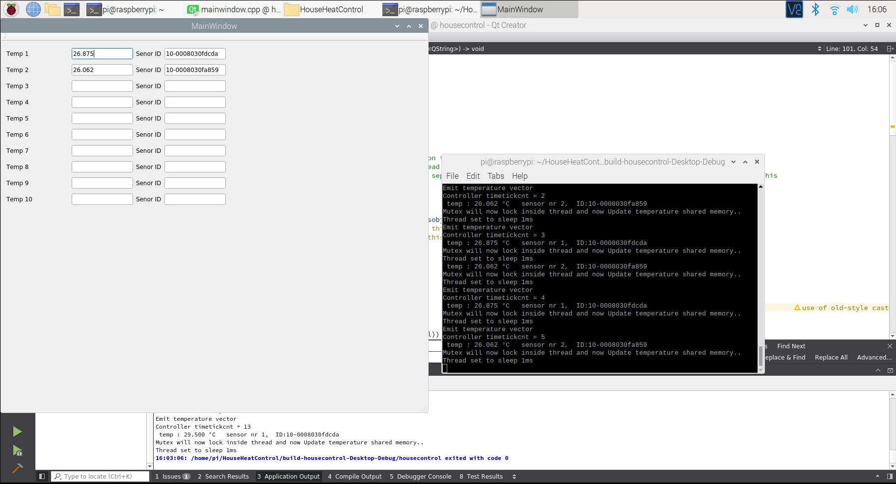

# Lyfco Heatpump HP050-DC-W Raspberry-pi-QT-GUI-with-DS18B20-temperature-sensor-and-PID-controller

Under development...

Supported Hardware:

Lyfco Heatpump HP050-DC-W
    
Raspberry pi

DS18B20

## tinytuya for controlling my Lyfco Heatpump HP050-DC-W

### Install tinytuya

Tinytuya don't use Cloud connection to you tuya device.

"tinytuya" connect directly localy to your tuya device (In my case Lyfco Heatpump HP050-DC-W) 

Related links

https://github.com/jasonacox/tinytuya

tinytuya need the LocalKey from you tuya device.

### Extract Tuya LocalKey

Important Note: Don't share your LocalKey, keep your LocalKey secure on your computer.

https://www.youtube.com/watch?v=FpY-xsY-pZ8

## Installation of QT creator on Raspberry pi

### Installing Qt5 Creative:
    $ sudo apt-get update
    $ sudo apt-get install build-essential
    $ sudo apt-get install qtcreator
    $ sudo apt-get install qt5-default
    
### Install BOOST (don't know if nessesary..)
    $ sudo apt install libboost-dev
    $ sudo apt install libboost-all-dev

verify

    $ dpkg -s libboost-dev | grep Version

### Option QWT Ploting

#### Installera QWT Ploting (Optional future develoments with graph plotter)

    $ sudo apt-get install qtdeclarative5-dev-tools
    $ sudo apt-get install libqwt-qt5-dev

#### Change inside QT project file if using QWT Plotting 

    LIBS += -lqwt-qt5

in the project file for Qt5
with name 

    *.pro 

Example find here:

    https://github.com/berndporr/qwt-example
    
    $ git clone https://github.com/glasgow-bio/qwt-example

 
