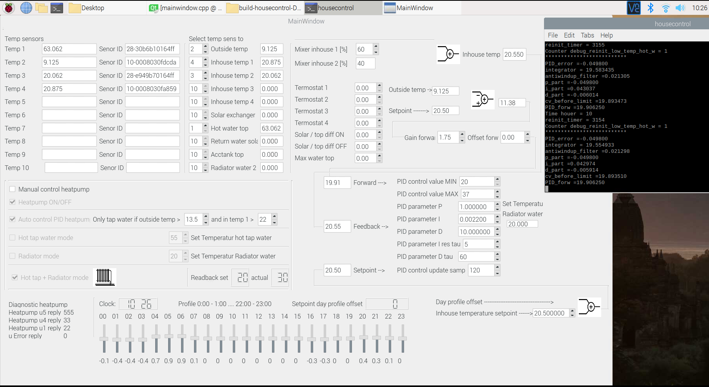

# Lyfco Heatpump HP050-DC-W Raspberry-pi-QT-GUI-with-DS18B20-temperature-sensor-and-PID-controller

https://www.youtube.com/watch?v=0cIs1EkFDYE

### Supported Hardware:

#### Lyfco Heatpump HP050-DC-W
    
#### Raspberry pi

#### DS18B20

## IMPORTANT note

Step 1.

You ALWAYS need to start the python script heatpump socket server FIRST by the command:

    $ python heatpump_server.py
    
Step 2.

Then Start the QT GUI aplication were the socket client is attached

    $ ./housecontrol
    
If you start the QT GUI aplication socket client first then this program will exit automatic becuse no socket server is up.

## QT GUI inteface example (under development)

## tinytuya for controlling my Lyfco Heatpump HP050-DC-W

### Install tinytuya

Example of the heatpump_server.py terminal echo

    Received 40 bytes
    Received contents command=6, i1=30, i2=0, i3=0, i=0, i5=0, i6=0, i7=0, i8=0, i9=0
    ON heatpump
    set temperature to 30
    set_status() result {u'devId': u'xxxxxxxxxxxxxxxxxxxxxxxx', u'dps': {u'13': 0, u'109': u'32', u'110': u'15', u'1': True, u'114': u'30', u'3': 38, u'2': 30, u'5':       u'Hot', u'4': u'hot', u'113': u'30', u'112': u'16', u'103': u'on', u'111': u'16', u'106': u'd01', u'107': 32, u'104': u'2', u'105': 94}}
    Send contents back, command=6, i1=30, i2=0, i3=38, i=30, i5=0, i6=555, i7=55, i8=22, i9=0
    Sending it back.. 

    Sent 40 bytes
    
    

Tinytuya don't use Cloud connection to you tuya device.

"tinytuya" connect directly localy to your tuya device (In my case Lyfco Heatpump HP050-DC-W) 

Related links

https://github.com/jasonacox/tinytuya

tinytuya need the LocalKey from you tuya device.

### Extract Tuya LocalKey

Important Note: Don't share your LocalKey, keep your LocalKey secure on your computer.

https://www.youtube.com/watch?v=FpY-xsY-pZ8

## Installation of QT creator on Raspberry pi

### Installing Qt5 Creative:
    $ sudo apt-get update
    $ sudo apt-get install build-essential
    $ sudo apt-get install qtcreator
    $ sudo apt-get install qt5-default
    
### Install BOOST (don't know if nessesary..)
    $ sudo apt install libboost-dev
    $ sudo apt install libboost-all-dev

verify

    $ dpkg -s libboost-dev | grep Version

### Option QWT Ploting

#### Installera QWT Ploting (Optional future develoments with graph plotter)

    $ sudo apt-get install qtdeclarative5-dev-tools
    $ sudo apt-get install libqwt-qt5-dev

#### Change inside QT project file if using QWT Plotting 

    LIBS += -lqwt-qt5

in the project file for Qt5
with name 

    *.pro 

Example find here:

    https://github.com/berndporr/qwt-example
    
    $ git clone https://github.com/glasgow-bio/qwt-example

 
